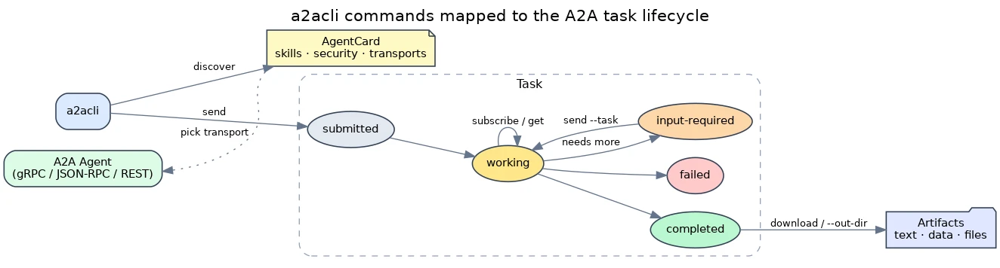

# A2A CLI

[](https://github.com/ghchinoy/a2acli/releases)
[](LICENSE)

A standalone, A2A Specification v1.0 compliant command-line client for discovering, messaging, and managing agents. Built on the [a2a-go](https://github.com/a2aproject/a2a-go) SDK with an interactive streaming TUI and a scriptable JSON mode.

## What is A2A?

**A2A (Agent-to-Agent)** is an open protocol for talking to AI agents over a network — discover what an agent can do, send it a message, and stream back results and artifacts, regardless of how the agent is built. Every agent publishes an **AgentCard** (its skills, security requirements, and transports); you send a **message** that creates a **task**; the task moves through states (`working` → `completed`) and may produce **artifacts** (text, data, files).

`a2acli` is the command-line client for that protocol. To learn the protocol itself, see the canonical site: **[a2a-protocol.org](https://a2a-protocol.org/latest/)**.



## Installation

### macOS and Linux — Homebrew

```bash
brew tap ghchinoy/tap
brew trust ghchinoy/tap
brew install a2acli
```

### Linux — Install Script

```bash
curl -sL https://raw.githubusercontent.com/ghchinoy/a2acli/main/scripts/install.sh | bash
```

### Linux — apt (Debian / Ubuntu)

Download the `.deb` from the [latest release](https://github.com/ghchinoy/a2acli/releases/latest):

```bash
sudo dpkg -i a2acli_*.deb
```

### Linux — rpm (Fedora / RHEL)

Download the `.rpm` from the [latest release](https://github.com/ghchinoy/a2acli/releases/latest):

```bash
sudo rpm -i a2acli_*.rpm
```

### Windows — winget

```powershell
winget install ghchinoy.a2acli
```

### Any platform — Go Install

```bash
go install github.com/ghchinoy/a2acli/cmd/a2acli@latest
```

### From Source

```bash
git clone https://github.com/ghchinoy/a2acli.git
cd a2acli
make build   # binary is written to bin/a2acli
```

### Verify your install

```bash
a2acli version
```

You should see version, commit, and build-date information. If the command isn't
found, ensure your install location (e.g. `$(go env GOPATH)/bin` for `go install`,
or `./bin` when building from source) is on your `PATH`.

## 5-Minute Tutorial

You don't need a remote agent to get started — `a2acli` can run a local mock agent
for you. This golden path runs entirely on your machine, no auth required.

**1. Start a local echo agent** (in one terminal, or background it with `&`):

```bash
a2acli serve --echo --port 9001
```

**2. Discover what it can do** — fetch its AgentCard, skills, and security schemes:

```bash
a2acli discover --service-url http://localhost:9001
```

**3. Send it a message** and stream the response in real time:

```bash
a2acli send "Hello, agent!" --service-url http://localhost:9001
```

That's the full loop: **serve → discover → send**. The echo agent simply returns
your message, which is exactly what you want when learning the mechanics.

**4. Get a single JSON result** instead of the interactive UI — this is the form
scripts and AI agents use:

```bash
a2acli send "Hello, agent!" --service-url http://localhost:9001 --output json --wait
```

### Graduating to a real agent

Once the loop makes sense, point the same commands at a real agent. If it's
protected by OAuth 2.1, log in once and every later command is authenticated
automatically — no `--token` needed:

```bash
a2acli auth login --service-url https://agent.example.com   # browser opens once
a2acli send "hello" --service-url https://agent.example.com --wait   # auto-authenticated
```

Tired of retyping URLs? Save a named environment and use `--env`:

```bash
a2acli config env add prod --service-url https://agent.example.com
a2acli send "hello" --env prod --wait
```

See the [Reference Manual](docs/MANUAL.md#client-configuration) for full config details.

## Command Overview

Commands are organized into four A2A-aligned groups. The table below is a map;
the [Reference Manual](docs/MANUAL.md) has the full flag lists, examples, and
output schemas for each.

| Command | Group | What it does |
|---|---|---|
| [`discover`](docs/MANUAL.md#discover--inspect-an-agent) | Discovery | Fetch an agent's AgentCard, skills, and security schemes |
| [`send`](docs/MANUAL.md#send--send-a-message) | Messaging | Send a message to initiate or continue a task |
| [`subscribe`](docs/MANUAL.md#subscribe-watch--subscribe-to-a-task) | Messaging | Subscribe to a running task's event stream |
| [`get`](docs/MANUAL.md#get--get-task-status) | Messaging | Retrieve state and artifacts of a task by ID |
| [`list tasks`](docs/MANUAL.md#list--list-tasks) | Messaging | List historical tasks (with `--status`/`--context` filters) |
| [`cancel`](docs/MANUAL.md#cancel--cancel-a-task) | Messaging | Cancel an active task |
| [`push-config`](docs/MANUAL.md#push-config--push-notification-configs) | Messaging | Manage push-notification callbacks for a task |
| [`download`](docs/MANUAL.md#download--download-artifacts) | Messaging | Download artifacts from a completed task |
| [`serve`](docs/MANUAL.md#serve--run-a-mock-agent) | Server | Run a local mock A2A agent for testing |
| [`auth`](docs/MANUAL.md#authentication) | Config | OAuth 2.1 login/status/token/logout |
| [`conformance`](docs/MANUAL.md#conformance--a2a-conformance-smoke-check) | Server | Run A2A conformance smoke checks against a live server |
| [`a2ui validate`](docs/MANUAL.md#a2ui-validate--a2ui-extension-conformance) | Server | Validate A2UI v1.0 extension wire conformance |
| [`config`](docs/MANUAL.md#client-configuration) | Config | Manage named environments |

**Output modes** are controlled by `--output`: `tui` (default interactive),
`text` (plain, for CI/pipes), and `json` (NDJSON for scripting). `a2acli`
auto-degrades from `tui` to `text` when output isn't a terminal. See
[Output Modes](docs/MANUAL.md#output-modes).

For the complete grammar, every flag, global flags, shell completion, and
automation guidance, see the **[Reference Manual](docs/MANUAL.md)**.

## Using a2acli from AI Coding Agents

`a2acli` is designed to be driven by AI coding agents (Claude Code, Cursor, GitHub
Copilot CLI) as well as shell scripts. Two rules make it deterministic in
non-interactive contexts:

1. Pass `--output json` (or `-n`) to disable the TUI and emit parseable NDJSON.
2. Pass `--wait` with `send` to block until the task completes.

This repository is a conformant [Agent Plugins Specification v1.0.0](https://agent-plugins.org) plugin package shipping [`agentskills.io`](https://agentskills.io/) compliant
[skills](skills/) that teach coding agents how to use, build, and evaluate A2A services:

- [**`a2acli`**](skills/a2acli/SKILL.md) — Teaches agents how to interact with A2A services from the command line using `a2acli`.
- [**`a2a-expose`**](skills/a2a-expose/SKILL.md) — Guides developers and agents in adding a compliant A2A exposure layer to an existing API or service.
- [**`a2a-conformance`**](skills/a2a-conformance/SKILL.md) — Evaluates an A2A agent against normative spec rules, stable check IDs, and TCK orchestration.

See the [**Agent Skills Guide**](docs/SKILLS.md) for full usage scenarios, prompt libraries, and authoring guidelines.

## Development

```bash
make build      # Compile to bin/a2acli
make run        # Build and run
make lint       # Run golangci-lint
make test-e2e   # Run end-to-end conformance tests
make diagrams   # Re-render docs/diagrams/*.dot to docs/img/*.webp
make clean      # Remove bin/
```

For release instructions see [docs/RELEASING.md](docs/RELEASING.md).

### Conformance (TCK)

`a2acli` is tested against the official A2A Technology Compatibility Kit for both
**v0.3.0** and **v1.0.0**. See the [Conformance Report](docs/CONFORMANCE_REPORT.md)
for current status.

Running the tests requires the [a2a-go](https://github.com/a2aproject/a2a-go) SDK
source locally, as the suite spins up the TCK SUT server dynamically:

```bash
# Default path: ../../github/a2a-go
make test-e2e

# Custom path
make test-e2e A2A_GO_SRC=/path/to/a2a-go
```

To run the SUT manually:

```bash
# In the a2a-go repository
cd e2e/tck
go run sut.go sut_agent_executor.go
```

## Contributing

Contributions are welcome. See [CONTRIBUTING.md](CONTRIBUTING.md) for guidelines and [docs/CLI_DESIGN_BEST_PRACTICES.md](docs/CLI_DESIGN_BEST_PRACTICES.md) for design conventions to follow before adding or modifying commands.

## License

Apache 2.0. See [LICENSE](LICENSE).
