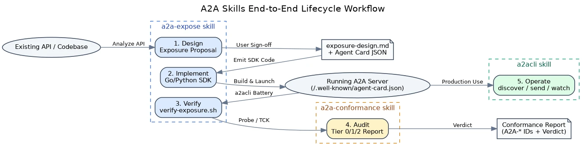

import { Steps, Aside } from '@astrojs/starlight/components';

This page walks through a single, concrete flow: an AI coding agent, driven by
the [`a2acli` skill](/a2acli/agent-usage/skills-reference/a2acli/), discovers an
agent, finds a skill on its card, and invokes it — all deterministically, with
`--output json`. It adapts **Scenario E (day-to-day CLI operation)** from the
repository's Agent Skills Guide.

The three skills compose across the lifecycle; this example is the "production
operation" stage on the right of the workflow:



## The prompt the agent receives

> **"Discover the skills on `http://localhost:9001` and run the summarize skill
> on this text."**

This matches the `a2acli` skill's trigger keywords, so the agent activates it and
follows its Critical Rules.

## The flow

<Steps>

1. ### Preflight the binary

   The skill requires `a2acli` on `PATH`, so the agent checks it first:

   ```bash
   a2acli version
   ```

   If this fails, the agent installs the binary or stops cleanly — it does not
   guess. See [Installation](/a2acli/getting-started/installation/).

2. ### Discover the agent (`--output json`)

   The agent fetches the AgentCard as machine-readable JSON — never the TUI:

   ```bash
   a2acli discover --service-url http://localhost:9001 --output json
   ```

   It reads the `skills` array to confirm a `summarize` skill exists:

   ```json
   {
     "name": "Example Agent",
     "skills": [
       { "id": "summarize", "name": "Summarize", "description": "Summarize text" }
     ]
   }
   ```

   See [Discovery &amp; Identity](/a2acli/reference/discovery-identity/) for the
   full card shape.

3. ### Send the task (blocking, `--output json`)

   `send` **blocks by default** and returns a single JSON document once the task
   reaches a terminal state — the agent adds no `--wait` and no `--stream`:

   ```bash
   a2acli send "Summarize this text: ..." \
     --service-url http://localhost:9001 \
     --skill summarize \
     --output json
   ```

4. ### Read `status.state`, then the artifacts

   The agent inspects `status.state` to branch on success or failure, then reads
   the produced artifacts:

   ```json
   {
     "id": "task-abc123",
     "status": { "state": "TASK_STATE_COMPLETED" },
     "artifacts": [
       {
         "name": "summary",
         "parts": [{ "text": "A concise summary of the input text." }]
       }
     ]
   }
   ```

   - `TASK_STATE_COMPLETED` → read `artifacts` and return the result.
   - `TASK_STATE_FAILED` → surface the failure; the error envelope (on stdout)
     carries `error.code`, `error.message`, and `error.hint`.

   The process exit code confirms the outcome for scripting: `0` success,
   `2` usage error, `1` any other failure.

</Steps>

## Why each rule matters here

<Aside type="tip" title="Determinism in one place">
Every choice above comes from the
[determinism rules](/a2acli/agent-usage/overview/#determinism-rules-for-agents):
`--output json` keeps the output parseable, the default-blocking `send` means one
document to read (no polling loop), `status.state` is the single source of the
outcome, and exit codes give a non-JSON fallback signal.
</Aside>

## Authenticated variant

Against an OAuth 2.1-protected agent, the agent logs in once (a human completes
the browser flow), after which every command reuses the stored token
automatically:

```bash
# One-time interactive login
a2acli auth login --service-url https://agent.example.com

# Subsequent commands auto-authenticate — no --token needed
a2acli send "Summarize this text: ..." \
  --service-url https://agent.example.com \
  --skill summarize \
  --output json
```

For a fully non-interactive runtime, the agent retrieves the stored token and
passes it explicitly:

```bash
TOKEN=$(a2acli auth token --service-url https://agent.example.com)
a2acli send "Summarize this text: ..." \
  --service-url https://agent.example.com \
  --token "$TOKEN" \
  --output json
```

See [Configuration &amp; Auth](/a2acli/reference/configuration-auth/#auth) for the
full auth workflow.

## Related

- [Skills reference → a2acli](/a2acli/agent-usage/skills-reference/a2acli/)
- [Messaging &amp; Tasks](/a2acli/reference/messaging-tasks/) — every flag for
  `send` and `get`.
- [Direct-usage tutorial](/a2acli/tutorial/) — the same commands, run by a human.
